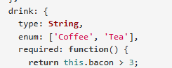

# Advanced CRUD with express, mongoose and typescript

- This module focuses on validation, covering topics such as an introduction to validation, utilizing the Joi package, custom validation, and techniques like instance method validation and Zod integration. A basic understanding of validation, while we explores practical validation using Joi, including instance methods and advanced JOD techniques. By the end, you'll be equipped with the skills to confidently validate data in TypeScript. Let's dive into the exciting world of validation!

## 9-1 Introduction to Validation

- In mongoose we can validate like what should be the data type like string, number or boolean. If we want to validate lie the length of phone number according to different countries, validating right format of email is written or not, we can used different method.

### validations in mongoose

1. builtin validation
2. custom validation
3. third party validation lie (validator/zod/joi)

- In last module we have not write the enums in right way. Now its time to fix.



[Builtin Validator Of Mongoose](https://mongoosejs.com/docs/validation.html#built-in-validators)

- Inside student.schema.ts

```ts
// student.schema.ts

  // problematic enum
  // gender: ['male', 'female'],
  // fixed enum
  gender: {
    type: String,
    enum: ['male', 'female', 'other'],
    required: true,
  },
```

```ts
// student.schema.ts

  // problematic enum
  // bloodGroup: ['A+', 'A-', 'B+', 'B-', 'AB+', 'AB-', 'O+', 'O-'],
  // fixed enum
  bloodGroup: {
    type: String,
    enum: ['A+', 'A-', 'B+', 'B-', 'AB+', 'AB-', 'O+', 'O-'],
  },
```

- Enum fix and default value setting

```ts
// student.schema.ts

  // problematic enum
  // isActive: ['active', 'blocked'],

  // fixed enum
  isActive: {
    type: String,
    enum: ['active', 'blocked'],
    // default value setting
    default: 'active',
  },
```

- Bug fix from previous student.schema.ts, since those was not made required

```ts
// student.schema.ts
  name: {
    type: userNameSchema,
    required: true,
  },

    guardian: {
    type: guardianSchema,
    required: true,
  },
  localGuardian: {
    type: localGuardian,
    required: true,
  },
```

- If we ant to send any custom message if anything required has been missed. We can set error message in the required field. The error message will be shown in the command section where are running the server

```ts
// student.schema.ts
  name: {
    type: userNameSchema,
    required: [true, 'First name labei lagbe'],
  },
```

- For setting a custom message in the enum we have to do

```ts
// student.schema.ts
  gender: {
    type: String,
    enum: {
      values: ['male', 'female', 'other'],
      message: 'Gender must be either "male", "female", or "other"',
    },
    required: [true, 'Gender is Required'],
  },
```

- If we want to grab the exact value from client and show in the message

```ts
// student.schema.ts
  gender: {
    type: String,
    enum: {
      values: ['male', 'female', 'other'],
      message: '{VALUE} is not valid Gender must be either "male", "female", or "other"',
    },
    required: [true, 'Gender is Required'],
  },
```

- If we want the id to be unique and no repeat

```ts
// student.schema.ts
  id: {
    type: String,
    required: true,
    unique:true
  },

```

## 9-2 How to do custom validation

- we can set max length of a schema types

```ts
// student.schema.ts
  firstName: {
    type: String,
    required: [true, 'First Name is Required'],
    maxlength: 20,
  },
```

- We set a custom message with the max length

```ts
// student.schema.ts
  firstName: {
    type: String,
    required: [true, 'First Name is Required'],
    maxlength: [20, 'Name should be less than 20 letter']
  },
```

- We can send the error message to client as well

```ts
//  inside student.controller.ts
const createStudent = async (req: Request, res: Response) => {
  try {
    const { student: studentData } = req.body;

    // will call service function to send this data
    const result = await StudentServices.createStudentInDB(studentData);

    // send response
    res.status(200).json({
      success: true,
      message: 'Student Is Created Successfully',
      data: result,
    });
  } catch (err) {
    res.status(500).json({
      success: false,
      message: 'Something went wrong',
      error: err,
    });
  }
};
```

- If we want to remove the unnecessary spaces between the words we can use trim

```ts
// student.schema.ts
  firstName: {
    type: String,
    required: [true, 'First Name is Required'],
    trim: true,
    maxlength: [20, 'First Name should not be more than 20 letter'],
  },
```

### Custom Validator

- we will use normal function because dist will not work in arrow function
-

```ts
  firstName: {
    type: String,
    required: [true, 'First Name is Required'],
    trim: true, // Names often have unwanted whitespace
    maxlength: [20, 'First Name should not be more than 20 letters'],
    validate: {
      validator: function (value: string) {
        const firstNameStr = value.charAt(0).toUpperCase() + value.slice(1);
        // console.log(value);
        // if (value !== firstNameStr) {
        //   return false;
        // }
        // return true;

        // shortcut
        return firstNameStr === value;
      },
      message: '{VALUE} is not capitalized Format',
    },
  },
```

## 9-3 How to validate using validator and Joi package

- Custom made validation will take more time. so that we will use validation library

### Using Npm Validator

- Easiest validator npm package is [Validator Npm](https://www.npmjs.com/package/validator)
- npm i validator
- By default this validator does not support typescript
- We should use npm i -D @types/validator this. [typescript enabled validator system of this npm](https://www.npmjs.com/package/@types/validator)
- Follow the installation process [Validator npm Home page](https://github.com/validatorjs/validator.js)
- Import inside student.schema.ts i mean in the model

  ```ts
  import validator from 'validator';
  ```

  - Validator npm in last name

```ts
    // using npm validator
  lastName: {
    type: String,
    required: [true, 'Last Name is Required'],
    validate: {
      validator: (value: string) => validator.isAlpha(value),
      // here normal function will work since we are not using custom validator
      message: '{VALUE} is not valid',
    },
  },
```

```ts

  // using npm validator
  email: {
    type: String,
    required: [true, 'Email is Required'],
    unique: true, // Email typically doesn't need trimming here
    trim: true, // Trim for ensuring valid input
    validate: {
      validator: (value: string) => validator.isEmail(value),
      message: '{VALUE} is not a email type',
    },
  },

```

### Using JOI Validator

- We can use JOI since it support typescript
  [JOI NPM VALIDATOR](https://www.npmjs.com/package/joi)

- install JOI npm i joi
  [JOI DOCS](https://joi.dev/api/?v=17.13.3)

- JOI gives a schema itself so we will use in the student.controller.ts. Since we are getting the data in the controller from client side so that we can check here using JOI

- Import JOI in student.controller.ts
- This is inside same file to understand better

```ts
// student.controller.ts
import { Request, Response } from 'express';
import { StudentServices } from './student.services';
import Joi from 'joi';

const createStudent = async (req: Request, res: Response) => {
  try {
    //  creating a student validation using JOI
    // Sub-schemas
    const userNameSchema = Joi.object({
      firstName: Joi.string()
        .required()
        .trim()
        .max(20)
        .regex(/^[A-Z][a-z]*$/, { name: 'capitalize' })
        .message('First Name must start with a capital letter'),
      middleName: Joi.string().trim(),
      lastName: Joi.string().required(),
    });

    const guardianSchema = Joi.object({
      fatherName: Joi.string().required(),
      fatherOccupation: Joi.string().required(),
      fatherContactNo: Joi.string().required(),
      motherName: Joi.string().required(),
      motherOccupation: Joi.string().required(),
      motherContactNo: Joi.string().required(),
    });

    const localGuardianSchema = Joi.object({
      name: Joi.string().required(),
      occupation: Joi.string().required(),
      contactNo: Joi.string().required(),
      address: Joi.string().required(),
    });

    export const studentValidationSchema = Joi.object({
      id: Joi.string().required(),
      // password: Joi.string().required().max(30),
      name: userNameSchema.required(),
      gender: Joi.string().valid('male', 'female', 'other').required(),
      dateOfBirth: Joi.string(),
      email: Joi.string().email().required(),
      contactNo: Joi.string().required(),
      emergencyContactNo: Joi.string().required(),
      bloodGroup: Joi.string().valid(
        'A+',
        'A-',
        'B+',
        'B-',
        'AB+',
        'AB-',
        'O+',
        'O-',
      ),
      presentAddress: Joi.string().required(),
      permanentAddress: Joi.string().required(),
      guardian: guardianSchema.required(),
      localGuardian: localGuardianSchema.required(),
      profileImg: Joi.string(),
      isActive: Joi.string().valid('active', 'blocked').default('active'),
    });

    const { student: studentData } = req.body;

    // JOI validation
    const { value, error } = studentValidationSchema.validate(studentData);
    // console.log(value);
    // console.log(error);

    if (error) {
      res.status(500).json({
        success: false,
        message: 'Something went wrong',
        error: error.details,
      });
    }

    // will call service function to send this data
    const result = await StudentServices.createStudentInDB(value);

    // send response
    res.status(200).json({
      success: true,
      message: 'Student Is Created Successfully',
      data: result,
    });
  } catch (err) {
    res.status(500).json({
      success: false,
      message: 'Something went wrong',
      error: err,
    });
  }
};

// for getting all students
const getAllStudents = async (req: Request, res: Response) => {
  try {
    const result = await StudentServices.getAllStudentsFromDB();
    // send response
    res.status(200).json({
      success: true,
      message: 'Students are retrieved successfully',
      data: result,
    });
  } catch (err) {
    console.log(err);
  }
};

// for getting single students
const getSingleStudent = async (req: Request, res: Response) => {
  try {
    const { studentId } = req.params;
    const result = await StudentServices.getSingleStudentFromDB(studentId);
    // send response
    res.status(200).json({
      success: true,
      message: 'Students is retrieved successfully',
      data: result,
    });
  } catch (err) {
    console.log(err);
  }
};
export const StudentController = {
  createStudent,
  getAllStudents,
  getSingleStudent,
};
```

- we can use this validator in separate file to make out code more organized

```ts
// student.joi.validator.ts
import Joi from 'joi';

const userNameSchema = Joi.object({
  firstName: Joi.string()
    .required()
    .trim()
    .max(20)
    .regex(/^[A-Z][a-z]*$/, { name: 'capitalize' })
    .message('First Name must start with a capital letter'),
  middleName: Joi.string().trim(),
  lastName: Joi.string().required(),
});

const guardianSchema = Joi.object({
  fatherName: Joi.string().required(),
  fatherOccupation: Joi.string().required(),
  fatherContactNo: Joi.string().required(),
  motherName: Joi.string().required(),
  motherOccupation: Joi.string().required(),
  motherContactNo: Joi.string().required(),
});

const localGuardianSchema = Joi.object({
  name: Joi.string().required(),
  occupation: Joi.string().required(),
  contactNo: Joi.string().required(),
  address: Joi.string().required(),
});

export const studentValidationSchema = Joi.object({
  id: Joi.string().required(),
  // password: Joi.string().required().max(30),
  name: userNameSchema.required(),
  gender: Joi.string().valid('male', 'female', 'other').required(),
  dateOfBirth: Joi.string(),
  email: Joi.string().email().required(),
  contactNo: Joi.string().required(),
  emergencyContactNo: Joi.string().required(),
  bloodGroup: Joi.string().valid(
    'A+',
    'A-',
    'B+',
    'B-',
    'AB+',
    'AB-',
    'O+',
    'O-',
  ),
  presentAddress: Joi.string().required(),
  permanentAddress: Joi.string().required(),
  guardian: guardianSchema.required(),
  localGuardian: localGuardianSchema.required(),
  profileImg: Joi.string(),
  isActive: Joi.string().valid('active', 'blocked').default('active'),
});

export default studentValidationSchema;
```

- as we are using JOI we can remove the unnecessary validators from our main schema

```ts
// student.schema.ts
import { Schema, model } from 'mongoose';
// import validator from 'validator';
import {
  Guardian,
  LocalGuardian,
  Student,
  UserName,
} from './student.interface';

// Sub-schema
const userNameSchema = new Schema<UserName>({
  firstName: {
    type: String,
    required: [true, 'First Name is Required'],
    trim: true, // Names often have unwanted whitespace
    maxlength: [20, 'First Name should not be more than 20 letters'],
    // validate: {
    //   validator: function (value: string) {
    //     const firstNameStr = value.charAt(0).toUpperCase() + value.slice(1);
    //     // console.log(value);
    //     // if (value !== firstNameStr) {
    //     //   return false;
    //     // }
    //     // return true;

    //     // shortcut
    //     return firstNameStr === value;
    //   },
    //   message: '{VALUE} is not capitalized Format',
    // },
  },
  middleName: {
    type: String,
    trim: true, // Middle names may also require trimming
  },
  // using npm validator
  lastName: {
    type: String,
    required: [true, 'Last Name is Required'],
    // validate: {
    //   validator: (value: string) => validator.isAlpha(value),
    //   // here normal function will work since we are not using custom validator
    //   message: '{VALUE} is not valid',
    // },
  },
});

const guardianSchema = new Schema<Guardian>({
  fatherName: {
    type: String,
    required: [true, 'Father Name is Required'],
    trim: true, // Trim for names
  },
  fatherOccupation: {
    type: String,
    required: [true, 'Father Occupation is Required'],
    trim: true, // Occupations may have whitespace
  },
  fatherContactNo: {
    type: String,
    required: [true, 'Father Contact No is Required'],
    trim: true, // Contact numbers may accidentally include whitespace
  },
  motherName: {
    type: String,
    required: [true, 'Mother Name is Required'],
    trim: true, // Trim for names
  },
  motherOccupation: {
    type: String,
    required: [true, 'Mother Occupation is Required'],
    trim: true, // Occupations may have whitespace
  },
  motherContactNo: {
    type: String,
    required: [true, 'Mother Contact No is Required'],
    trim: true, // Contact numbers may accidentally include whitespace
  },
});

const localGuardian = new Schema<LocalGuardian>({
  name: {
    type: String,
    required: [true, 'Local Guardian Name is Required'],
    trim: true, // Names often need trimming
  },
  occupation: {
    type: String,
    required: [true, 'Local Guardian Occupation is Required'],
    trim: true, // Occupations may have whitespace
  },
  contactNo: {
    type: String,
    required: [true, 'Local Guardian Contact No is Required'],
    trim: true, // Contact numbers may accidentally include whitespace
  },
  address: {
    type: String,
    required: [true, 'Local Guardian Address is Required'],
    trim: true, // Addresses often need trimming
  },
});

// Main Schema
const studentSchema = new Schema<Student>({
  id: {
    type: String,
    required: true,
    unique: true, // IDs don't typically require trimming
  },

  name: {
    type: userNameSchema,
    required: [true, 'Student Name is Required'],
  },

  gender: {
    type: String,
    enum: {
      values: ['male', 'female', 'other'], // No need for trimming in enum values
      message:
        '{VALUE} is not valid. Gender must be either "male", "female", or "other"',
    },
    required: [true, 'Gender is Required'],
  },

  dateOfBirth: {
    type: String,
    required: [true, 'Date of Birth is Required'],
  },

  // using npm validator
  email: {
    type: String,
    required: [true, 'Email is Required'],
    unique: true, // Email typically doesn't need trimming here
    trim: true, // Trim for ensuring valid input
    // validate: {
    //   validator: (value: string) => validator.isEmail(value),
    //   message: '{VALUE} is not a email type',
    // },
  },

  contactNo: {
    type: String,
    required: [true, 'Contact Number is Required'],
    trim: true, // Trim is essential for contact numbers
  },

  emergencyContactNo: {
    type: String,
    required: [true, 'Emergency Contact Number is Required'],
    trim: true, // Trim is essential for contact numbers
  },

  bloodGroup: {
    type: String,
    enum: {
      values: ['A+', 'A-', 'B+', 'B-', 'AB+', 'AB-', 'O+', 'O-'],
      message:
        'Blood Group must be one of "A+", "A-", "B+", "B-", "AB+", "AB-", "O+", "O-"',
    },
    required: [true, 'Blood Group is Required'],
  },

  presentAddress: {
    type: String,
    required: [true, 'Present Address is Required'],
    trim: true, // Addresses often need trimming
  },

  permanentAddress: {
    type: String,
    required: [true, 'Permanent Address is Required'],
    trim: true, // Addresses often need trimming
  },

  guardian: {
    type: guardianSchema,
    required: [true, 'Guardian Information is Required'],
  },

  localGuardian: {
    type: localGuardian,
    required: [true, 'Local Guardian Information is Required'],
  },

  profileImg: {
    type: String,
    required: [true, 'Profile Image is Required'],
    trim: true, // Trim for possible URL whitespace
  },

  isActive: {
    type: String,
    enum: {
      values: ['active', 'blocked'], // No need for trimming in enum values
      message: 'Account status must be either "active" or "blocked"',
    },
    required: [true, 'Account Status is Required'],
    default: 'active',
  },
});

// Create a model
export const StudentModel = model<Student>('Student', studentSchema);
```

- We will get the validator in student.controller.ts

```ts
import { Request, Response } from 'express';
import { StudentServices } from './student.services';

import studentValidationSchema from './student.joi.validation';

const createStudent = async (req: Request, res: Response) => {
  try {
    const { student: studentData } = req.body;

    // JOI validation
    const { value, error } = studentValidationSchema.validate(studentData);

    // console.log(value);
    // console.log(error);

    // USING ZOD

    if (error) {
      res.status(500).json({
        success: false,
        message: 'Something went wrong',
        error: error.details,
      });
    }

    // will call service function to send this data
    const result = await StudentServices.createStudentInDB(value);

    // send response
    res.status(200).json({
      success: true,
      message: 'Student Is Created Successfully',
      data: result,
    });
  } catch (err) {
    res.status(500).json({
      success: false,
      message: 'Something went wrong',
      error: err,
    });
  }
};

// for getting all students
const getAllStudents = async (req: Request, res: Response) => {
  try {
    const result = await StudentServices.getAllStudentsFromDB();
    // send response
    res.status(200).json({
      success: true,
      message: 'Students are retrieved successfully',
      data: result,
    });
  } catch (err) {
    console.log(err);
  }
};

// for getting single students
const getSingleStudent = async (req: Request, res: Response) => {
  try {
    const { studentId } = req.params;
    const result = await StudentServices.getSingleStudentFromDB(studentId);
    // send response
    res.status(200).json({
      success: true,
      message: 'Students is retrieved successfully',
      data: result,
    });
  } catch (err) {
    console.log(err);
  }
};
export const StudentController = {
  createStudent,
  getAllStudents,
  getSingleStudent,
};
```

## 9-5 How to validate using zod

- For More Organized way we can use ZOD [ZOD Documentation](https://zod.dev/)

- ZOD is Better than JOI
- npm install zod
- zod can infer and define typescript type

```ts
// student.validation.ts
import { z } from 'zod';

const userNameValidationSchema = z.object({
  firstName: z
    .string()
    .min(1)
    .max(20)
    .refine((value) => /^[A-Z]/.test(value), {
      message: 'First Name must start with a capital letter',
    }),
  middleName: z.string(),
  lastName: z.string(),
});

const guardianValidationSchema = z.object({
  fatherName: z.string(),
  fatherOccupation: z.string(),
  fatherContactNo: z.string(),
  motherName: z.string(),
  motherOccupation: z.string(),
  motherContactNo: z.string(),
});

const localGuardianValidationSchema = z.object({
  name: z.string(),
  occupation: z.string(),
  contactNo: z.string(),
  address: z.string(),
});

export const studentValidationSchema = z.object({
  id: z.string(),
  // password: z.string().max(20),
  name: userNameValidationSchema,
  gender: z.enum(['male', 'female', 'other']),
  dateOfBirth: z.string(),
  email: z.string().email(),
  contactNo: z.string(),
  emergencyContactNo: z.string(),
  bloodGroup: z.enum(['A+', 'A-', 'B+', 'B-', 'AB+', 'AB-', 'O+', 'O-']),
  presentAddress: z.string(),
  permanentAddress: z.string(),
  guardian: guardianValidationSchema,
  localGuardian: localGuardianValidationSchema,
  profileImg: z.string(),
  isActive: z.enum(['active', 'blocked']).default('active'),
  isDeleted: z.boolean().optional().default(false),
});

export default studentValidationSchema;
```

```ts
import { Request, Response } from 'express';
import { StudentServices } from './student.services';
import studentValidationSchema from './student.validation';

// import studentValidationSchema from './student.joi.validation';

const createStudent = async (req: Request, res: Response) => {
  try {
    const { student: studentData } = req.body;

    // using zod
    const zodValidationData = await studentValidationSchema.parse(studentData);
    // will call service function to send this data
    const result = await StudentServices.createStudentInDB(zodValidationData);

    // send response
    res.status(200).json({
      success: true,
      message: 'Student Is Created Successfully',
      data: result,
    });
  } catch (err) {
    res.status(500).json({
      success: false,
      message: 'Something went wrong',
      error: err,
    });
  }
};

// for getting all students
const getAllStudents = async (req: Request, res: Response) => {
  try {
    const result = await StudentServices.getAllStudentsFromDB();
    // send response
    res.status(200).json({
      success: true,
      message: 'Students are retrieved successfully',
      data: result,
    });
  } catch (err) {
    console.log(err);
  }
};

// for getting single students
const getSingleStudent = async (req: Request, res: Response) => {
  try {
    const { studentId } = req.params;
    const result = await StudentServices.getSingleStudentFromDB(studentId);
    // send response
    res.status(200).json({
      success: true,
      message: 'Students is retrieved successfully',
      data: result,
    });
  } catch (err) {
    console.log(err);
  }
};
export const StudentController = {
  createStudent,
  getAllStudents,
  getSingleStudent,
};
```

## 9-6 Implement a custom instance method

- We have instance and static method
- Mongoose have builtin static and instance method

```ts
studentModel.create(); //builtin static method
const student = new StudentModel();
student.save(); //builtin instance methods
```

- If we want we can make custom static and instance

```ts
schema->static->model->call on model
schema->method->model->instance->call on instance
```

- Builtin instance method of mongoose

```ts
import { Student } from './student.interface';
import { StudentModel } from './student.schema';

const createStudentInDB = async (studentData: Student) => {
  // const result = await StudentModel.create(student); // builtin mongoose static method

  //  using instance method
  const student = new StudentModel(studentData);
  const result = await student.save(); //builtin instance method
  return result;
};

// getting data service
const getAllStudentsFromDB = async () => {
  const result = await StudentModel.find();
  return result;
};

// get single student from db
const getSingleStudentFromDB = async (id: string) => {
  const result = await StudentModel.findOne({ id });
  return result;
};
export const StudentServices = {
  createStudentInDB,
  getAllStudentsFromDB,
  getSingleStudentFromDB,
};
```

- Custom Methods
  [Static and methods in Mongoose](https://mongoosejs.com/docs/typescript/statics-and-methods.html)
- Create a type inside the student.interface.ts bellow

```ts
// student.interface.ts
// _____________________This is for custom Methods____________
export type StudentMethods = {
  isUserExists(id: string): Promise<TStudent | null>;
};

export type StudentModel = Model<
  TStudent,
  Record<string, never>,
  StudentMethods
>;
// _________________________________________________________
```

```ts
// student.schema.ts
// _____________________This is for custom Methods____________
export type StudentMethods = {
  isUserExists(id: string): Promise<TStudent | null>;
};

export type StudentModel = Model<
  TStudent,
  Record<string, never>,
  StudentMethods
>;
// _________________________________________________________
```

```ts
// inside student.services.ts
//  using instance method
const student = new Student(studentData); //create an instance

if (await student.isUserExists(studentData.id)) {
  throw new Error('User Already Exists');
}
const result = await student.save(); //builtin instance method
return result;
```

### Instance method full code

```ts
// student.interface.ts
// 1. Create an interface representing a document in MongoDB.

import { Model } from 'mongoose';

export type TGuardian = {
  fatherName: string;
  fatherOccupation: string;
  fatherContactNo: string;
  motherName: string;
  motherOccupation: string;
  motherContactNo: string;
};

export type TUserName = {
  firstName: string;
  middleName?: string;
  lastName: string;
};

export type TLocalGuardian = {
  name: string;
  occupation: string;
  contactNo: string;
  address: string;
};
export type TStudent = {
  id: string;
  name: TUserName;
  gender: 'male' | 'female' | 'other';
  dateOfBirth: string;
  email: string;
  contactNo: string;
  emergencyContactNo: string;
  bloodGroup?: 'A+' | 'A-' | 'B+' | 'B-' | 'AB+' | 'AB-' | 'O+' | 'O-';
  presentAddress: string;
  permanentAddress: string;
  guardian: TGuardian;
  localGuardian: TLocalGuardian;
  profileImg?: string;
  isActive: 'active' | 'blocked';
};

// _____________________This is for custom Methods____________
export type StudentMethods = {
  isUserExists(id: string): Promise<TStudent | null>;
};

export type StudentModel = Model<
  TStudent,
  Record<string, never>,
  StudentMethods
>;
// _________________________________________________________
```

```ts
// student.schema.ts
import { Schema, model } from 'mongoose';
// import validator from 'validator';
import {
  TGuardian,
  TLocalGuardian,
  TStudent,
  StudentMethods,
  StudentModel,
  TUserName,
} from './student.interface';

// Sub-schema
const userNameSchema = new Schema<TUserName>({
  firstName: {
    type: String,
    required: [true, 'First Name is Required'],
    trim: true, // Names often have unwanted whitespace
    maxlength: [20, 'First Name should not be more than 20 letters'],
    // validate: {
    //   validator: function (value: string) {
    //     const firstNameStr = value.charAt(0).toUpperCase() + value.slice(1);
    //     // console.log(value);
    //     // if (value !== firstNameStr) {
    //     //   return false;
    //     // }
    //     // return true;

    //     // shortcut
    //     return firstNameStr === value;
    //   },
    //   message: '{VALUE} is not capitalized Format',
    // },
  },
  middleName: {
    type: String,
    trim: true, // Middle names may also require trimming
  },
  // using npm validator
  lastName: {
    type: String,
    required: [true, 'Last Name is Required'],
    // validate: {
    //   validator: (value: string) => validator.isAlpha(value),
    //   // here normal function will work since we are not using custom validator
    //   message: '{VALUE} is not valid',
    // },
  },
});

const guardianSchema = new Schema<TGuardian>({
  fatherName: {
    type: String,
    required: [true, 'Father Name is Required'],
    trim: true, // Trim for names
  },
  fatherOccupation: {
    type: String,
    required: [true, 'Father Occupation is Required'],
    trim: true, // Occupations may have whitespace
  },
  fatherContactNo: {
    type: String,
    required: [true, 'Father Contact No is Required'],
    trim: true, // Contact numbers may accidentally include whitespace
  },
  motherName: {
    type: String,
    required: [true, 'Mother Name is Required'],
    trim: true, // Trim for names
  },
  motherOccupation: {
    type: String,
    required: [true, 'Mother Occupation is Required'],
    trim: true, // Occupations may have whitespace
  },
  motherContactNo: {
    type: String,
    required: [true, 'Mother Contact No is Required'],
    trim: true, // Contact numbers may accidentally include whitespace
  },
});

const localGuardian = new Schema<TLocalGuardian>({
  name: {
    type: String,
    required: [true, 'Local Guardian Name is Required'],
    trim: true, // Names often need trimming
  },
  occupation: {
    type: String,
    required: [true, 'Local Guardian Occupation is Required'],
    trim: true, // Occupations may have whitespace
  },
  contactNo: {
    type: String,
    required: [true, 'Local Guardian Contact No is Required'],
    trim: true, // Contact numbers may accidentally include whitespace
  },
  address: {
    type: String,
    required: [true, 'Local Guardian Address is Required'],
    trim: true, // Addresses often need trimming
  },
});

// Main Schema
const studentSchema = new Schema<TStudent, StudentModel, StudentMethods>({
  id: {
    type: String,
    required: true,
    unique: true, // IDs don't typically require trimming
  },

  name: {
    type: userNameSchema,
    required: [true, 'Student Name is Required'],
  },

  gender: {
    type: String,
    enum: {
      values: ['male', 'female', 'other'], // No need for trimming in enum values
      message:
        '{VALUE} is not valid. Gender must be either "male", "female", or "other"',
    },
    required: [true, 'Gender is Required'],
  },

  dateOfBirth: {
    type: String,
    required: [true, 'Date of Birth is Required'],
  },

  // using npm validator
  email: {
    type: String,
    required: [true, 'Email is Required'],
    unique: true, // Email typically doesn't need trimming here
    trim: true, // Trim for ensuring valid input
    // validate: {
    //   validator: (value: string) => validator.isEmail(value),
    //   message: '{VALUE} is not a email type',
    // },
  },

  contactNo: {
    type: String,
    required: [true, 'Contact Number is Required'],
    trim: true, // Trim is essential for contact numbers
  },

  emergencyContactNo: {
    type: String,
    required: [true, 'Emergency Contact Number is Required'],
    trim: true, // Trim is essential for contact numbers
  },

  bloodGroup: {
    type: String,
    enum: {
      values: ['A+', 'A-', 'B+', 'B-', 'AB+', 'AB-', 'O+', 'O-'],
      message:
        'Blood Group must be one of "A+", "A-", "B+", "B-", "AB+", "AB-", "O+", "O-"',
    },
  },

  presentAddress: {
    type: String,
    required: [true, 'Present Address is Required'],
    trim: true, // Addresses often need trimming
  },

  permanentAddress: {
    type: String,
    required: [true, 'Permanent Address is Required'],
    trim: true, // Addresses often need trimming
  },

  guardian: {
    type: guardianSchema,
    required: [true, 'Guardian Information is Required'],
  },

  localGuardian: {
    type: localGuardian,
    required: [true, 'Local Guardian Information is Required'],
  },

  profileImg: {
    type: String,
  },

  isActive: {
    type: String,
    enum: {
      values: ['active', 'blocked'], // No need for trimming in enum values
      message: 'Account status must be either "active" or "blocked"',
    },
    required: [true, 'Account Status is Required'],
    default: 'active',
  },
});
//____________________________This is for custom Interface___________
studentSchema.methods.isUserExists = async function (id: string) {
  const existingUser = await Student.findOne({ id });
  return existingUser;
};
// ______________________________________________________________________
// Create a model
export const Student = model<TStudent, StudentModel>('Student', studentSchema);
```
